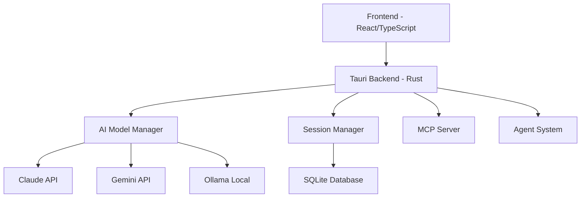

# CLAUDIA.md - Technical Implementation Guide

## System Architecture

### Core Components



## Session Management Implementation

### Session Isolation Architecture
```rust
// Session isolation implementation
pub struct IsolatedSession {
    id: SessionId,
    context: Arc<RwLock<SessionContext>>,
    memory_boundary: MemoryBoundary,
    event_channel: mpsc::Sender<SessionEvent>,
    dedup_cache: LruCache<String, ResponseData>,
}

impl IsolatedSession {
    pub fn new() -> Self {
        Self {
            id: SessionId::generate(), // UUID v4 + timestamp + salt
            context: Arc::new(RwLock::new(SessionContext::new())),
            memory_boundary: MemoryBoundary::strict(),
            event_channel: mpsc::channel(1000).0,
            dedup_cache: LruCache::new(100),
        }
    }
    
    pub async fn validate_operation(&self, op: &Operation) -> Result<(), SessionError> {
        // Validate session boundaries
        if !self.memory_boundary.contains(op.target()) {
            return Err(SessionError::BoundaryViolation);
        }
        
        // Check for duplicate operations
        if self.dedup_cache.contains(&op.fingerprint()) {
            return Err(SessionError::DuplicateOperation);
        }
        
        Ok(())
    }
}
```

### TypeScript Frontend Integration
```typescript
// Session store implementation
class SessionStore {
    private sessions: Map<string, Session> = new Map();
    private activeSession: string | null = null;
    
    async createSession(model: AIModel): Promise<string> {
        const sessionId = await invoke<string>('create_isolated_session', {
            model,
            timestamp: Date.now(),
            isolationLevel: 'strict'
        });
        
        const session = new Session(sessionId, model);
        this.sessions.set(sessionId, session);
        
        // Set up isolated event listeners
        this.setupIsolatedListeners(sessionId);
        
        return sessionId;
    }
    
    private setupIsolatedListeners(sessionId: string) {
        // Create session-specific event channel
        const eventChannel = `session-${sessionId}`;
        
        listen(eventChannel, (event) => {
            // Ensure events only affect their own session
            const session = this.sessions.get(sessionId);
            if (session && this.validateEventOrigin(event, sessionId)) {
                session.handleEvent(event);
            }
        });
    }
}
```

## Model Integration System

### Unified Model Interface
```typescript
interface UnifiedModelInterface {
    // Core methods all models must implement
    initialize(): Promise<void>;
    sendMessage(prompt: string, context?: Context): Promise<Response>;
    streamResponse(prompt: string, onChunk: ChunkHandler): Promise<void>;
    
    // Feature support
    supportsAgents(): boolean;
    supportsMCP(): boolean;
    supportsSlashCommands(): boolean;
    supportsCheckpoints(): boolean;
    
    // Model-specific capabilities
    getCapabilities(): ModelCapabilities;
    validateRequest(request: Request): ValidationResult;
}

// Model adapter implementations
class ClaudeAdapter implements UnifiedModelInterface {
    async sendMessage(prompt: string, context?: Context): Promise<Response> {
        return await invoke('execute_claude_code', {
            prompt,
            model: this.modelId,
            session_id: context?.sessionId,
            isolation_level: 'strict'
        });
    }
    
    supportsAgents(): boolean { return true; }
    supportsMCP(): boolean { return true; }
    supportsSlashCommands(): boolean { return true; }
    supportsCheckpoints(): boolean { return true; }
}

class GeminiAdapter implements UnifiedModelInterface {
    async sendMessage(prompt: string, context?: Context): Promise<Response> {
        return await invoke('execute_gemini_enhanced', {
            prompt,
            model: this.modelId,
            session_id: context?.sessionId,
            system_instruction: context?.systemPrompt
        });
    }
    
    supportsAgents(): boolean { return true; }
    supportsMCP(): boolean { return true; } // New implementation
    supportsSlashCommands(): boolean { return true; } // New implementation
    supportsCheckpoints(): boolean { return true; }
}

class OllamaAdapter implements UnifiedModelInterface {
    private async detectAvailableModels(): Promise<string[]> {
        const response = await fetch('http://localhost:11434/api/tags');
        const data = await response.json();
        return data.models.map(m => m.name);
    }
    
    async initialize(): Promise<void> {
        this.availableModels = await this.detectAvailableModels();
    }
    
    supportsAgents(): boolean { return true; }
    supportsMCP(): boolean { return true; } // New implementation
    supportsSlashCommands(): boolean { return true; } // New implementation
    supportsCheckpoints(): boolean { return true; }
}
```

## Debugging System Architecture

### Multi-Level Debug Logger
```rust
pub struct DebugLogger {
    level: DebugLevel,
    tracers: Vec<Box<dyn Tracer>>,
    profiler: Profiler,
}

impl DebugLogger {
    pub fn log(&self, level: DebugLevel, message: &str, context: Context) {
        if level >= self.level {
            let entry = LogEntry {
                timestamp: SystemTime::now(),
                level,
                message: message.to_string(),
                context,
                call_stack: self.capture_stack(),
                performance: self.profiler.current_metrics(),
            };
            
            // Log to multiple outputs
            self.log_to_file(&entry);
            self.log_to_console(&entry);
            self.log_to_telemetry(&entry);
            
            // Trigger tracers for detailed analysis
            for tracer in &self.tracers {
                tracer.trace(&entry);
            }
        }
    }
    
    fn capture_stack(&self) -> Vec<StackFrame> {
        backtrace::Backtrace::new()
            .frames()
            .iter()
            .map(|frame| StackFrame::from(frame))
            .collect()
    }
}
```

### Dependency Validator
```typescript
class DependencyValidator {
    private dependencies: Map<string, DependencyInfo> = new Map();
    
    async validateAll(): Promise<ValidationReport> {
        const report = new ValidationReport();
        
        // Check package dependencies
        const packageDeps = await this.loadPackageDependencies();
        for (const [name, version] of packageDeps) {
            const validation = await this.validateDependency(name, version);
            report.add(validation);
        }
        
        // Check system dependencies
        const systemDeps = await this.checkSystemDependencies();
        report.addSystemChecks(systemDeps);
        
        // Check compatibility matrix
        const compatibility = await this.checkCompatibility();
        report.addCompatibility(compatibility);
        
        return report;
    }
    
    private async validateDependency(name: string, version: string): Promise<DependencyValidation> {
        const info = await this.fetchDependencyInfo(name, version);
        
        return {
            name,
            version,
            isValid: info.isSupported,
            hasVulnerabilities: info.vulnerabilities.length > 0,
            hasConflicts: this.checkConflicts(name, version),
            recommendations: this.getRecommendations(info)
        };
    }
}
```

## Error Knowledge Base System

### Error Tracking Implementation
```rust
pub struct ErrorKnowledgeBase {
    db: Arc<Mutex<Connection>>,
    patterns: Vec<ErrorPattern>,
    resolutions: HashMap<String, Resolution>,
}

impl ErrorKnowledgeBase {
    pub async fn track_error(&self, error: &Error) -> Result<ErrorRecord> {
        let fingerprint = self.generate_fingerprint(error);
        
        // Check if we've seen this error before
        if let Some(resolution) = self.resolutions.get(&fingerprint) {
            // Apply known resolution
            if resolution.auto_fixable {
                self.apply_auto_fix(resolution).await?;
            }
            return Ok(ErrorRecord::resolved(error, resolution));
        }
        
        // New error - analyze and store
        let analysis = self.analyze_error(error).await?;
        let record = ErrorRecord::new(error, analysis);
        
        // Store in database
        self.store_error_record(&record).await?;
        
        // Learn from this error
        self.update_patterns(&record);
        
        Ok(record)
    }
    
    async fn apply_auto_fix(&self, resolution: &Resolution) -> Result<()> {
        for step in &resolution.steps {
            match step.action {
                Action::ModifyFile(path, changes) => {
                    self.apply_file_changes(path, changes).await?;
                }
                Action::RestartService(service) => {
                    self.restart_service(service).await?;
                }
                Action::ClearCache(cache_type) => {
                    self.clear_cache(cache_type).await?;
                }
                _ => {}
            }
        }
        Ok(())
    }
}
```

## Visual Progress Tracker Component

### React Component Implementation
```tsx
const ProgressTracker: React.FC = () => {
    const [goals, setGoals] = useState<Goal[]>([]);
    const [metrics, setMetrics] = useState<ProgressMetrics>();
    
    useEffect(() => {
        // Subscribe to progress updates
        const unsubscribe = progressStore.subscribe((state) => {
            setGoals(state.goals);
            setMetrics(state.metrics);
        });
        
        return unsubscribe;
    }, []);
    
    return (
        <div className="progress-tracker">
            <div className="progress-header">
                <h3>Session Progress</h3>
                <ProgressBar value={metrics?.completionRate || 0} />
            </div>
            
            <div className="progress-sections">
                <Section title="To Do" items={goals.filter(g => g.status === 'pending')} />
                <Section title="In Progress" items={goals.filter(g => g.status === 'active')} />
                <Section title="Completed" items={goals.filter(g => g.status === 'done')} />
                <Section title="Blocked" items={goals.filter(g => g.status === 'blocked')} />
            </div>
            
            <div className="progress-charts">
                <BurndownChart data={metrics?.burndown} />
                <VelocityChart data={metrics?.velocity} />
                <BlockerHeatmap data={metrics?.blockers} />
            </div>
        </div>
    );
};
```

## Task Timeline Component

### Timeline Implementation
```tsx
const TaskTimeline: React.FC = () => {
    const [sessions, setSessions] = useState<SessionSummary[]>([]);
    const [filter, setFilter] = useState<TimelineFilter>('all');
    
    const renderSessionSummary = (session: SessionSummary) => (
        <div className="timeline-item" key={session.id}>
            <div className="timeline-marker" data-status={session.status} />
            <div className="timeline-content">
                <div className="timeline-header">
                    <span className="session-id">{session.id}</span>
                    <span className="session-time">{formatTime(session.timestamp)}</span>
                    <StatusBadge status={session.status} />
                </div>
                <div className="timeline-tasks">
                    {session.tasks.map(task => (
                        <TaskItem key={task.id} task={task} />
                    ))}
                </div>
                <div className="timeline-metrics">
                    <Metric label="Success Rate" value={session.metrics.successRate} />
                    <Metric label="Duration" value={session.metrics.duration} />
                    <Metric label="Tasks" value={session.tasks.length} />
                </div>
            </div>
        </div>
    );
    
    return (
        <div className="task-timeline">
            <TimelineHeader onFilterChange={setFilter} />
            <div className="timeline-container">
                {sessions
                    .filter(s => matchesFilter(s, filter))
                    .map(renderSessionSummary)}
            </div>
            <TimelineAnalytics sessions={sessions} />
        </div>
    );
};
```

## Database Schema

```sql
-- Session isolation tables
CREATE TABLE sessions (
    id TEXT PRIMARY KEY,
    created_at INTEGER NOT NULL,
    model TEXT NOT NULL,
    isolation_level TEXT NOT NULL,
    context_boundary BLOB,
    status TEXT NOT NULL
);

CREATE TABLE session_events (
    id INTEGER PRIMARY KEY AUTOINCREMENT,
    session_id TEXT NOT NULL,
    timestamp INTEGER NOT NULL,
    event_type TEXT NOT NULL,
    payload TEXT,
    fingerprint TEXT UNIQUE,
    FOREIGN KEY (session_id) REFERENCES sessions(id)
);

-- Error knowledge base tables
CREATE TABLE error_records (
    id INTEGER PRIMARY KEY AUTOINCREMENT,
    fingerprint TEXT UNIQUE,
    error_type TEXT NOT NULL,
    message TEXT,
    stack_trace TEXT,
    context TEXT,
    first_occurrence INTEGER NOT NULL,
    last_occurrence INTEGER NOT NULL,
    occurrence_count INTEGER DEFAULT 1,
    resolution_id INTEGER,
    FOREIGN KEY (resolution_id) REFERENCES resolutions(id)
);

CREATE TABLE resolutions (
    id INTEGER PRIMARY KEY AUTOINCREMENT,
    error_fingerprint TEXT NOT NULL,
    steps TEXT NOT NULL,
    success_rate REAL,
    auto_fixable BOOLEAN DEFAULT 0,
    prevention_strategy TEXT
);

-- Progress tracking tables
CREATE TABLE progress_goals (
    id INTEGER PRIMARY KEY AUTOINCREMENT,
    session_id TEXT NOT NULL,
    title TEXT NOT NULL,
    description TEXT,
    status TEXT NOT NULL,
    priority INTEGER,
    created_at INTEGER NOT NULL,
    completed_at INTEGER,
    FOREIGN KEY (session_id) REFERENCES sessions(id)
);

CREATE TABLE progress_metrics (
    id INTEGER PRIMARY KEY AUTOINCREMENT,
    session_id TEXT NOT NULL,
    timestamp INTEGER NOT NULL,
    completion_rate REAL,
    velocity REAL,
    blocked_count INTEGER,
    estimated_completion INTEGER,
    FOREIGN KEY (session_id) REFERENCES sessions(id)
);
```

## Testing Strategy

### Unit Tests
```typescript
describe('SessionIsolation', () => {
    it('should prevent cross-session contamination', async () => {
        const session1 = await createSession('model1');
        const session2 = await createSession('model2');
        
        await session1.execute('operation1');
        await session2.execute('operation2');
        
        expect(session1.getContext()).not.toContain('operation2');
        expect(session2.getContext()).not.toContain('operation1');
    });
    
    it('should detect and prevent duplicate operations', async () => {
        const session = await createSession('model');
        const operation = { type: 'test', payload: 'data' };
        
        await session.execute(operation);
        await expect(session.execute(operation)).rejects.toThrow('DuplicateOperation');
    });
});
```

### Integration Tests
```rust
#[cfg(test)]
mod tests {
    use super::*;
    
    #[tokio::test]
    async fn test_model_detection() {
        let detector = ModelDetector::new();
        let models = detector.detect_all().await.unwrap();
        
        assert!(models.contains_key("claude"));
        assert!(models.contains_key("gemini"));
        assert!(models.contains_key("ollama"));
    }
    
    #[tokio::test]
    async fn test_error_auto_fix() {
        let kb = ErrorKnowledgeBase::new();
        let error = TestError::new("known_error");
        
        let record = kb.track_error(&error).await.unwrap();
        assert!(record.was_auto_fixed);
    }
}
```

## Performance Optimization

### Caching Strategy
```typescript
class ResponseCache {
    private cache: LRUCache<string, CachedResponse>;
    private ttl: number = 5 * 60 * 1000; // 5 minutes
    
    async get(key: string): Promise<Response | null> {
        const cached = this.cache.get(key);
        if (cached && !this.isExpired(cached)) {
            return cached.response;
        }
        return null;
    }
    
    async set(key: string, response: Response): Promise<void> {
        this.cache.set(key, {
            response,
            timestamp: Date.now(),
            hits: 0
        });
    }
}
```

## Monitoring & Telemetry

```typescript
class Telemetry {
    private metrics: MetricsCollector;
    private events: EventCollector;
    
    trackSessionHealth(sessionId: string): void {
        setInterval(() => {
            const health = this.calculateHealth(sessionId);
            this.metrics.record('session.health', health, {
                sessionId,
                timestamp: Date.now()
            });
        }, 10000); // Every 10 seconds
    }
    
    trackModelPerformance(model: string, latency: number): void {
        this.metrics.record('model.latency', latency, { model });
        this.updatePerformanceBaseline(model, latency);
    }
}
```

---

**Last Updated**: August 2025
**Version**: 1.0.0
**For Internal Development Use**