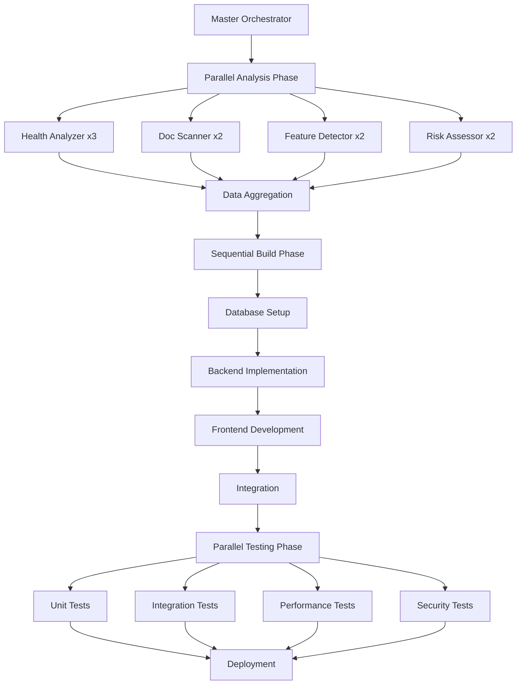

# Claudia Dashboard - Agent Architecture & Development Strategy

## 🤖 Required Agents for Dashboard Implementation

### 1. Core Development Agents

#### 1.1 **Dashboard Analyzer Agent**
- **Purpose**: Analyze existing codebase and extract metrics
- **Capabilities**: 
  - Code complexity analysis
  - Dependency scanning
  - Security vulnerability detection
  - Performance bottleneck identification
- **Tools**: Grep, Read, Glob, Sequential MCP
- **Activation**: `--persona-analyzer --think-hard`

#### 1.2 **Dashboard Architect Agent**
- **Purpose**: Design system architecture and data flow
- **Capabilities**:
  - Component architecture design
  - Database schema optimization
  - API contract definition
  - Integration planning
- **Tools**: Context7 MCP, Sequential MCP
- **Activation**: `--persona-architect --ultrathink`

#### 1.3 **Dashboard Builder Agent**
- **Purpose**: Implement frontend components and backend logic
- **Capabilities**:
  - React component generation
  - Rust command implementation
  - Database query optimization
  - API endpoint creation
- **Tools**: Write, Edit, MultiEdit, Magic MCP
- **Activation**: `--persona-frontend` or `--persona-backend`

#### 1.4 **Dashboard QA Agent**
- **Purpose**: Test and validate dashboard functionality
- **Capabilities**:
  - Unit test generation
  - Integration testing
  - Performance testing
  - Visual regression testing
- **Tools**: Playwright MCP, Sequential MCP
- **Activation**: `--persona-qa --validate`

#### 1.5 **Dashboard Security Agent**
- **Purpose**: Ensure security compliance and risk assessment
- **Capabilities**:
  - Vulnerability scanning
  - Access control validation
  - Data privacy compliance
  - Security pattern enforcement
- **Tools**: Sequential MCP, Context7 MCP
- **Activation**: `--persona-security --ultrathink`

### 2. Specialized Agents

#### 2.1 **Metrics Collector Agent**
- **Purpose**: Gather and process project metrics
- **Capabilities**:
  - Git history analysis
  - Code metric extraction
  - Performance data collection
  - AI usage tracking
- **Tools**: Bash, Grep, Read
- **Parallel Processing**: Yes (per metric type)

#### 2.2 **Documentation Scanner Agent**
- **Purpose**: Analyze documentation completeness
- **Capabilities**:
  - Markdown parsing
  - Coverage calculation
  - Missing section detection
  - Quality scoring
- **Tools**: Read, Glob, Sequential MCP
- **Parallel Processing**: Yes (per doc type)

#### 2.3 **Risk Assessment Agent**
- **Purpose**: Identify and evaluate project risks
- **Capabilities**:
  - Security risk detection
  - Technical debt evaluation
  - Performance risk analysis
  - Dependency vulnerability scanning
- **Tools**: Sequential MCP, Context7 MCP
- **Parallel Processing**: Yes (per risk category)

## 🛠️ Required MCP Tools

### 1. **Context7 MCP** (Documentation & Patterns)
- **Usage**: 
  - React component patterns
  - Rust best practices
  - Security patterns
  - Testing frameworks
- **Integration Points**:
  - Component generation
  - API design patterns
  - Documentation templates

### 2. **Sequential MCP** (Complex Analysis)
- **Usage**:
  - Project health calculation algorithms
  - Risk assessment logic
  - Dependency analysis
  - Performance optimization strategies
- **Integration Points**:
  - Health metric formulas
  - Risk scoring algorithms
  - Optimization recommendations

### 3. **Magic MCP** (UI Components)
- **Usage**:
  - Dashboard component generation
  - Chart and visualization components
  - Responsive design patterns
  - Accessibility compliance
- **Integration Points**:
  - Health metric visualizations
  - Progress indicators
  - Risk assessment UI
  - AI usage charts

### 4. **Playwright MCP** (Testing & Validation)
- **Usage**:
  - E2E dashboard testing
  - Performance benchmarking
  - Visual regression testing
  - Cross-browser compatibility
- **Integration Points**:
  - Dashboard load testing
  - Real-time update validation
  - Export functionality testing

## 🔄 Parallel Processing Strategy

### 1. Task Classification for Parallelization

#### 1.1 **Fully Parallel Tasks** (No Dependencies)
```yaml
parallel_tasks:
  - name: "Health Metrics Collection"
    agents: [metrics_collector_1, metrics_collector_2, metrics_collector_3]
    tasks:
      - security_analysis
      - dependency_scanning
      - complexity_calculation
      - performance_profiling
    
  - name: "Documentation Analysis"
    agents: [doc_scanner_1, doc_scanner_2]
    tasks:
      - readme_analysis
      - api_doc_scan
      - guide_completeness
      - changelog_review
    
  - name: "Feature Detection"
    agents: [feature_analyzer_1, feature_analyzer_2]
    tasks:
      - component_scanning
      - route_analysis
      - module_detection
      - api_endpoint_discovery
```

#### 1.2 **Sequential Tasks** (With Dependencies)
```yaml
sequential_tasks:
  - name: "Database Setup"
    order:
      1: create_schema
      2: apply_migrations
      3: seed_initial_data
      4: verify_integrity
    
  - name: "Component Integration"
    order:
      1: create_base_components
      2: integrate_with_api
      3: add_state_management
      4: connect_to_dashboard
```

#### 1.3 **Hybrid Tasks** (Partial Parallelization)
```yaml
hybrid_tasks:
  - name: "Dashboard Implementation"
    parallel_groups:
      - group_1: [frontend_components, styling]
      - group_2: [backend_commands, database_queries]
      - group_3: [api_endpoints, data_models]
    sequential_integration:
      1: merge_frontend_backend
      2: integrate_api
      3: test_full_system
```

### 2. Agent Orchestration Pattern



## 🔒 Isolated Development Environment

### 1. Feature Branch Strategy

```bash
# Create isolated feature branch
git checkout -b feature/dashboard-upgrade

# Sub-branches for parallel development
git checkout -b feature/dashboard-upgrade/backend
git checkout -b feature/dashboard-upgrade/frontend
git checkout -b feature/dashboard-upgrade/database
```

### 2. Database Isolation

```sql
-- Create separate schema for dashboard development
CREATE SCHEMA IF NOT EXISTS dashboard_dev;

-- Use prefixed tables during development
CREATE TABLE dashboard_dev.project_health (...);
CREATE TABLE dashboard_dev.feature_registry (...);
CREATE TABLE dashboard_dev.risk_items (...);

-- Migration script for production
-- Will rename schema when ready
```

### 3. Component Isolation

```typescript
// New dashboard components in isolated directory
src/
  components/
    Dashboard/              # New isolated dashboard
      experimental/        # Dev components
      __tests__/          # Isolated tests
      __mocks__/          # Mock data
    
    DashboardV2/          # Production-ready version
      index.tsx
      components/
      hooks/
      utils/
```

### 4. API Versioning

```rust
// Isolated API endpoints during development
#[tauri::command]
#[cfg(feature = "dashboard_dev")]
pub async fn get_dashboard_data_v2(
    project_id: String,
    db: State<'_, SqlitePool>,
) -> Result<DashboardDataV2, String> {
    // New implementation
}

// Feature flag in Cargo.toml
[features]
dashboard_dev = []
```

### 5. Configuration Isolation

```typescript
// Environment-specific configuration
const DASHBOARD_CONFIG = {
  development: {
    apiVersion: 'v2',
    enableMockData: true,
    cacheTimeout: 1000, // 1 second for dev
    endpoints: {
      health: '/api/v2/dashboard/health',
      features: '/api/v2/dashboard/features',
    }
  },
  production: {
    apiVersion: 'v1',
    enableMockData: false,
    cacheTimeout: 300000, // 5 minutes
    endpoints: {
      health: '/api/dashboard/health',
      features: '/api/dashboard/features',
    }
  }
};
```

### 6. Dependency Management

```json
// package.json - Isolated dependencies
{
  "devDependencies": {
    "@dashboard/charts": "workspace:*",
    "@dashboard/components": "workspace:*"
  },
  "optionalDependencies": {
    "dashboard-analytics": "^1.0.0"
  }
}
```

### 7. Testing Isolation

```typescript
// Isolated test suites
describe('Dashboard V2', () => {
  beforeAll(() => {
    // Use test database
    process.env.DATABASE_URL = 'sqlite:test_dashboard.db';
  });
  
  afterAll(() => {
    // Cleanup test data
    cleanupTestDatabase();
  });
  
  it('should not affect existing features', () => {
    // Test isolation
  });
});
```

## 🚦 Development Workflow

### Phase 1: Parallel Analysis (Week 1)
```yaml
agents:
  - dashboard_analyzer: 
      tasks: [code_analysis, metric_extraction]
      mcp: [sequential, context7]
  
  - security_scanner:
      tasks: [vulnerability_scan, risk_assessment]
      mcp: [sequential]
  
  - doc_analyzer:
      tasks: [documentation_scan, completeness_check]
      mcp: [context7]
```

### Phase 2: Parallel Development (Week 2-4)
```yaml
parallel_tracks:
  backend:
    agents: [backend_builder_1, backend_builder_2]
    tasks: 
      - database_schema
      - rust_commands
      - api_endpoints
    isolation: feature_flags
  
  frontend:
    agents: [frontend_builder_1, frontend_builder_2]
    tasks:
      - component_library
      - dashboard_views
      - state_management
    isolation: component_directory
  
  testing:
    agents: [qa_agent_1, qa_agent_2]
    tasks:
      - unit_tests
      - integration_tests
      - mocks_and_fixtures
    isolation: test_directory
```

### Phase 3: Integration (Week 5)
```yaml
sequential_integration:
  1: merge_backend_frontend
  2: api_integration
  3: state_synchronization
  4: performance_optimization
  5: security_hardening
```

### Phase 4: Validation (Week 6-7)
```yaml
parallel_validation:
  - e2e_testing:
      agent: qa_agent
      mcp: playwright
      
  - performance_testing:
      agent: performance_agent
      mcp: playwright
      
  - security_audit:
      agent: security_agent
      mcp: sequential
      
  - user_acceptance:
      agent: qa_agent
      mcp: playwright
```

## 📊 Agent Communication Protocol

### 1. Inter-Agent Messages
```typescript
interface AgentMessage {
  from: string;
  to: string | string[];
  type: 'task' | 'result' | 'error' | 'progress';
  payload: {
    taskId: string;
    data: any;
    metadata: {
      timestamp: number;
      priority: 'high' | 'medium' | 'low';
      dependencies?: string[];
    };
  };
}
```

### 2. Coordination Service
```rust
pub struct AgentCoordinator {
    agents: HashMap<String, AgentHandle>,
    message_queue: Arc<Mutex<VecDeque<AgentMessage>>>,
    task_graph: TaskDependencyGraph,
}

impl AgentCoordinator {
    pub async fn dispatch_parallel_tasks(&self, tasks: Vec<Task>) {
        let parallel_groups = self.task_graph.get_parallel_groups(&tasks);
        
        for group in parallel_groups {
            let handles: Vec<_> = group.into_iter()
                .map(|task| {
                    let agent = self.select_agent_for_task(&task);
                    tokio::spawn(async move {
                        agent.execute(task).await
                    })
                })
                .collect();
            
            // Wait for group completion
            futures::future::join_all(handles).await;
        }
    }
}
```

## 🎯 Success Metrics

### Agent Performance Metrics
- Task completion rate > 95%
- Parallel efficiency > 80%
- Error rate < 2%
- Agent coordination overhead < 5%

### Development Isolation Metrics
- Zero impact on existing features
- No production database modifications
- Complete rollback capability
- Feature flag coverage 100%

### Integration Success Criteria
- All tests passing in isolation
- No dependency conflicts
- Performance benchmarks met
- Security audit passed

This architecture ensures efficient parallel development while maintaining complete isolation from the existing Claudia codebase, enabling safe and rapid implementation of the dashboard upgrade.