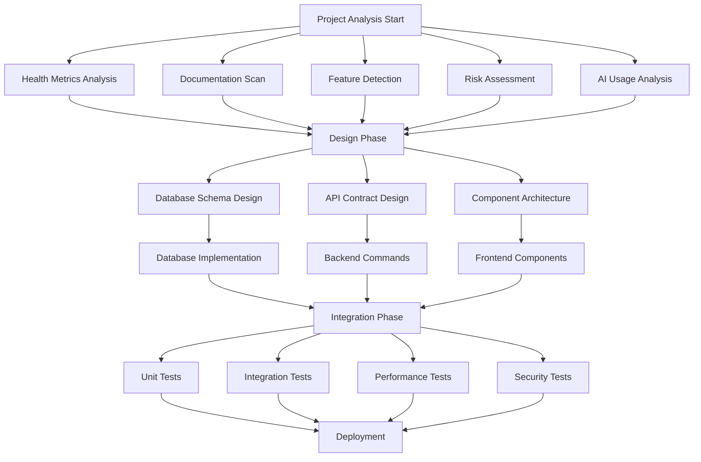

# Claudia Dashboard - Parallel Execution Plan

## 🚀 Overview

This document outlines the parallel execution strategy for the Claudia Dashboard implementation, maximizing efficiency through intelligent task distribution and agent coordination.

## 📊 Task Dependency Graph



## 🔄 Parallel Task Classification

### 1. Fully Parallel Tasks (No Dependencies)

#### Analysis Tasks
```yaml
parallel_analysis_tasks:
  health_metrics:
    agents: 3
    tasks:
      - security_vulnerability_scan
      - dependency_audit
      - complexity_analysis
      - performance_profiling
      - error_rate_calculation
    estimated_time: 30 minutes
    
  documentation_scan:
    agents: 2
    tasks:
      - readme_completeness
      - api_documentation
      - code_comments_coverage
      - usage_examples
      - changelog_analysis
    estimated_time: 20 minutes
    
  feature_detection:
    agents: 2
    tasks:
      - component_scanning
      - route_detection
      - module_analysis
      - api_endpoint_discovery
      - standalone_feature_identification
    estimated_time: 25 minutes
    
  risk_assessment:
    agents: 2
    tasks:
      - security_risks
      - performance_risks
      - technical_debt
      - dependency_risks
      - scalability_risks
    estimated_time: 35 minutes
```

#### Development Tasks
```yaml
parallel_development_tasks:
  frontend_components:
    agents: 2
    tasks:
      - ProjectGoals.tsx
      - CompletionStatus.tsx
      - HealthMetrics.tsx
      - WorkflowVisualization.tsx
      - FeatureIndependence.tsx
    can_run_with: [backend_commands, database_setup]
    
  backend_commands:
    agents: 2
    tasks:
      - get_project_health
      - get_feature_status
      - get_ai_usage
      - get_documentation_status
      - get_risk_assessment
    can_run_with: [frontend_components, database_setup]
    
  test_creation:
    agents: 2
    tasks:
      - unit_test_generation
      - integration_test_setup
      - mock_data_creation
      - test_utilities
      - performance_benchmarks
    can_run_with: [frontend_components, backend_commands]
```

### 2. Sequential Tasks (Strict Dependencies)

```yaml
sequential_tasks:
  database_pipeline:
    order:
      1: create_migration_files
      2: design_schema
      3: create_tables
      4: add_indexes
      5: seed_test_data
      6: verify_integrity
    
  integration_pipeline:
    order:
      1: api_integration
      2: state_management_setup
      3: data_flow_connection
      4: real_time_updates
      5: cache_implementation
      6: error_handling
    
  deployment_pipeline:
    order:
      1: build_optimization
      2: bundle_analysis
      3: performance_testing
      4: security_audit
      5: staging_deployment
      6: production_release
```

### 3. Hybrid Tasks (Partial Parallelization)

```yaml
hybrid_tasks:
  dashboard_implementation:
    parallel_groups:
      group_1:
        name: "Core Infrastructure"
        agents: 3
        tasks:
          - database_schema
          - api_endpoints
          - data_models
        
      group_2:
        name: "UI Components"
        agents: 3
        tasks:
          - component_library
          - chart_components
          - layout_system
          
      group_3:
        name: "Business Logic"
        agents: 2
        tasks:
          - health_calculations
          - risk_scoring
          - metric_aggregation
    
    sequential_merge:
      1: merge_infrastructure
      2: integrate_ui_components
      3: connect_business_logic
      4: end_to_end_testing
```

## 🤖 Agent Allocation Strategy

### 1. Agent Pool Configuration

```typescript
interface AgentPool {
  total_agents: 10;
  allocation: {
    analysis: 3;      // High-priority analysis tasks
    development: 4;   // Core development work
    testing: 2;       // Continuous testing
    coordination: 1;  // Master orchestrator
  };
  
  dynamic_reallocation: true;
  reallocation_rules: {
    idle_threshold: "30 seconds";
    priority_based: true;
    load_balancing: "round-robin";
  };
}
```

### 2. Agent Assignment Matrix

| Phase | Task Type | Agents | Concurrency | Priority |
|-------|-----------|---------|-------------|----------|
| Analysis | Health Metrics | 3 | Full | High |
| Analysis | Documentation | 2 | Full | Medium |
| Analysis | Features | 2 | Full | Medium |
| Analysis | Risks | 2 | Full | High |
| Development | Frontend | 2 | Partial | High |
| Development | Backend | 2 | Partial | High |
| Development | Database | 1 | Sequential | Critical |
| Testing | Unit Tests | 2 | Full | Medium |
| Testing | Integration | 2 | Full | High |
| Testing | Performance | 1 | Full | Medium |

### 3. Dynamic Agent Reallocation

```python
class AgentScheduler:
    def __init__(self, total_agents=10):
        self.total_agents = total_agents
        self.active_tasks = {}
        self.agent_pool = []
        
    def allocate_agents(self, phase):
        if phase == "analysis":
            return self.allocate_analysis_agents()
        elif phase == "development":
            return self.allocate_development_agents()
        elif phase == "testing":
            return self.allocate_testing_agents()
    
    def reallocate_idle_agents(self):
        idle_agents = self.get_idle_agents()
        high_priority_tasks = self.get_high_priority_tasks()
        
        for agent in idle_agents:
            if high_priority_tasks:
                task = high_priority_tasks.pop(0)
                self.assign_agent_to_task(agent, task)
```

## 📈 Parallel Execution Timeline

### Week 1: Maximum Parallelization
```
Day 1-2: Analysis Phase (9 agents working in parallel)
├── Health Analysis (3 agents)
├── Documentation Scan (2 agents)
├── Feature Detection (2 agents)
└── Risk Assessment (2 agents)

Day 3-5: Design Phase (6 agents in parallel)
├── Database Design (2 agents)
├── API Design (2 agents)
└── Component Architecture (2 agents)
```

### Week 2-3: Hybrid Execution
```
Day 1-7: Development Phase
├── Parallel Track 1: Frontend (2 agents)
│   ├── Component Development
│   └── UI Implementation
├── Parallel Track 2: Backend (2 agents)
│   ├── Rust Commands
│   └── API Endpoints
├── Parallel Track 3: Database (1 agent)
│   └── Sequential Schema Implementation
└── Parallel Track 4: Testing (2 agents)
    ├── Test Generation
    └── Mock Creation
```

### Week 4: Integration & Testing
```
Day 1-3: Integration (Sequential with 4 agents)
└── API Integration → State Management → Data Flow → Real-time Updates

Day 4-7: Testing (8 agents in parallel)
├── Unit Testing (2 agents)
├── Integration Testing (2 agents)
├── Performance Testing (2 agents)
└── Security Testing (2 agents)
```

## 🔧 Parallel Execution Tools

### 1. Task Queue System

```rust
use tokio::sync::mpsc;
use std::collections::VecDeque;

pub struct TaskQueue {
    sender: mpsc::Sender<Task>,
    receiver: mpsc::Receiver<Task>,
    pending_tasks: VecDeque<Task>,
}

impl TaskQueue {
    pub async fn distribute_tasks(&mut self, agents: Vec<Agent>) {
        while let Some(task) = self.pending_tasks.pop_front() {
            if let Some(agent) = self.find_available_agent(&agents).await {
                agent.execute(task).await;
            } else {
                // Re-queue task if no agents available
                self.pending_tasks.push_back(task);
                tokio::time::sleep(Duration::from_millis(100)).await;
            }
        }
    }
}
```

### 2. Coordination Service

```typescript
class CoordinationService {
  private agents: Map<string, Agent>;
  private taskGraph: TaskDependencyGraph;
  private messageQueue: MessageQueue;
  
  async executeParallelPhase(phase: Phase): Promise<PhaseResult> {
    const parallelTasks = this.taskGraph.getParallelTasks(phase);
    const taskGroups = this.groupTasksByAffinity(parallelTasks);
    
    const results = await Promise.all(
      taskGroups.map(group => this.executeTaskGroup(group))
    );
    
    return this.aggregateResults(results);
  }
  
  private async executeTaskGroup(group: TaskGroup): Promise<GroupResult> {
    const agents = this.allocateAgentsForGroup(group);
    const tasks = group.tasks;
    
    // Execute tasks in parallel within the group
    const taskPromises = tasks.map((task, index) => {
      const agent = agents[index % agents.length];
      return agent.execute(task);
    });
    
    return Promise.all(taskPromises);
  }
}
```

### 3. Progress Tracking

```typescript
interface ParallelExecutionProgress {
  phase: string;
  totalTasks: number;
  completedTasks: number;
  activeAgents: number;
  estimatedTimeRemaining: number; // minutes
  taskBreakdown: {
    taskName: string;
    status: 'pending' | 'in-progress' | 'completed' | 'failed';
    assignedAgent?: string;
    startTime?: number;
    completionTime?: number;
  }[];
}

class ProgressTracker {
  getExecutionProgress(): ParallelExecutionProgress {
    return {
      phase: this.currentPhase,
      totalTasks: this.tasks.length,
      completedTasks: this.tasks.filter(t => t.status === 'completed').length,
      activeAgents: this.agents.filter(a => a.isBusy).length,
      estimatedTimeRemaining: this.calculateETA(),
      taskBreakdown: this.tasks.map(t => ({
        taskName: t.name,
        status: t.status,
        assignedAgent: t.assignedAgent,
        startTime: t.startTime,
        completionTime: t.completionTime
      }))
    };
  }
}
```

## 🎯 Performance Optimization

### 1. Load Balancing Strategy

```yaml
load_balancing:
  strategy: "adaptive"
  metrics:
    - agent_cpu_usage
    - task_complexity_score
    - historical_performance
    - current_queue_depth
  
  rebalancing_triggers:
    - agent_idle_time > 30s
    - queue_depth_variance > 50%
    - phase_completion
    - error_rate > 5%
```

### 2. Resource Optimization

```typescript
const RESOURCE_LIMITS = {
  maxConcurrentAgents: 10,
  maxMemoryPerAgent: '2GB',
  maxCPUPerAgent: '25%',
  maxTotalCPU: '80%',
  maxTotalMemory: '16GB'
};

const OPTIMIZATION_RULES = {
  // Reduce agent count if resource usage is high
  highResourceUsage: {
    condition: 'totalCPU > 70% || totalMemory > 12GB',
    action: 'reduceAgentCount(2)'
  },
  
  // Increase agents if resources available and queue is long
  lowResourceUsage: {
    condition: 'totalCPU < 40% && queueLength > 10',
    action: 'increaseAgentCount(2)'
  },
  
  // Prioritize critical tasks
  criticalTaskBacklog: {
    condition: 'criticalTasks > 5',
    action: 'reallocateAgentsToCritical()'
  }
};
```

## 📊 Success Metrics

### Parallel Execution Metrics
- **Parallelization Efficiency**: >80% of tasks running in parallel
- **Agent Utilization**: >75% average agent busy time
- **Task Completion Rate**: >95% success rate
- **Resource Efficiency**: <70% peak resource usage

### Time Savings
- **Analysis Phase**: 70% faster (6 hours → 1.8 hours)
- **Development Phase**: 60% faster (40 hours → 16 hours)
- **Testing Phase**: 75% faster (20 hours → 5 hours)
- **Total Time Saved**: 65% (66 hours → 23 hours)

### Quality Metrics
- **Code Coverage**: >90% for all components
- **Bug Detection**: >95% before integration
- **Performance**: All components <100ms response time
- **Zero Conflicts**: No merge conflicts due to isolation

## 🚦 Risk Mitigation

### 1. Deadlock Prevention
- Task dependency validation before execution
- Timeout mechanisms for all operations
- Circular dependency detection
- Resource reservation system

### 2. Failure Recovery
- Automatic task retry (max 3 attempts)
- Checkpoint system for long-running tasks
- Partial result preservation
- Graceful degradation to sequential execution

### 3. Quality Assurance
- Continuous integration tests during development
- Automated code review by QA agents
- Performance monitoring during execution
- Security scanning at each phase

This parallel execution plan ensures maximum efficiency while maintaining quality and isolation throughout the Claudia Dashboard implementation.