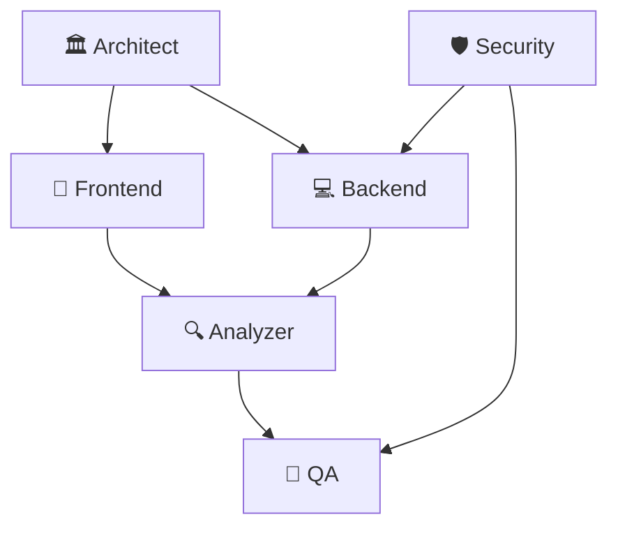

# 🎯 Gemini 통합 - 전문 에이전트 작업 분배표

**프로젝트**: Claudia Gemini Integration  
**실행 프레임워크**: SuperClaude + MCP  
**작성일**: 2025-01-31  
**상태**: 실행 준비 완료  

---

## 📋 **에이전트 할당 현황**

### **Wave 1: 기초 병렬 작업** (Week 1-2) - 4개 에이전트 동시 실행

#### 🏛️ **Architect Agent** - 시스템 설계 전문가
```yaml
담당 영역: 전체 시스템 아키텍처 및 MCP 통합 설계
우선순위: Critical Path - 다른 모든 에이전트의 기준점

주요 작업:
  1. 통합 시스템 아키텍처 설계
     - Claudia + Gemini CLI 통합 구조
     - MCP 서버 연동 아키텍처
     - 데이터 플로우 및 상태 관리

  2. API 인터페이스 설계
     - Tauri 명령어 구조 정의
     - TypeScript 타입 시스템
     - 에러 처리 및 응답 형식

  3. MCP 통합 전략
     - Context7: Gemini 문서 및 베스트 프랙티스
     - Sequential: 복잡한 하이브리드 로직
     - 성능 최적화 및 확장성 고려

출력물:
  - 📄 system-architecture.md
  - 📄 api-interfaces.md  
  - 📄 mcp-integration-strategy.md
  - 🗂️ 프로젝트 구조 템플릿

예상 소요시간: 3-4일
MCP 서버: Sequential (복잡한 설계), Context7 (최신 패턴)
```

#### 🛡️ **Security Agent** - 보안 설계 전문가
```yaml
담당 영역: API 키 관리, 보안 프로토콜, 권한 시스템
우선순위: Critical - 보안 없이는 배포 불가

주요 작업:
  1. API 키 관리 시스템
     - 암호화 저장 및 불러오기
     - 환경별 키 관리 (dev/prod)
     - 키 유효성 검증 및 로테이션

  2. 보안 프로토콜 설계
     - HTTPS 통신 보장
     - 민감 데이터 암호화
     - 로그 보안 및 감사 추적

  3. 권한 및 접근 제어
     - Windows UAC 처리
     - CLI 실행 권한 관리
     - 파일 시스템 접근 제어

출력물:
  - 📄 security-architecture.md
  - 📄 api-key-management.md
  - 🔒 보안 검증 체크리스트
  - 🛡️ 권한 관리 가이드

예상 소요시간: 3-4일
MCP 서버: Sequential (보안 분석), Context7 (보안 표준)
```

#### 🎨 **Frontend Agent** - UI/UX 전문가  
```yaml
담당 영역: Gemini UI 컴포넌트, 사용자 경험, 반응형 디자인
우선순위: High - Architect 완료 후 시작 가능

주요 작업:
  1. Gemini 패널 UI 구현
     - 채팅 인터페이스 컴포넌트
     - 모델 선택 및 설정 UI
     - 파일 업로드 및 첨부 시스템

  2. 디자인 시스템 확장
     - 기존 Claudia 스타일 유지
     - Gemini 브랜드 색상 통합
     - 다크모드 및 접근성 지원

  3. 사용자 경험 최적화
     - 로딩 상태 및 에러 처리
     - 키보드 단축키 지원
     - 반응형 레이아웃

출력물:
  - 🎨 GeminiPanel.tsx
  - 🎨 GeminiChatInterface.tsx
  - 🎨 GeminiSettings.tsx
  - 📱 반응형 CSS 스타일
  - 🎯 사용성 테스트 결과

예상 소요시간: 4-5일
MCP 서버: Magic (UI 생성), Context7 (React 패턴)
```

#### 💻 **Backend Agent** - 서버사이드 전문가
```yaml
담당 영역: Rust/Tauri 백엔드, CLI 래퍼, 데이터 처리
우선순위: High - Architect 완료 후 시작 가능

주요 작업:
  1. Gemini CLI 래퍼 서비스
     - CLI 명령어 실행 및 파싱
     - 비동기 처리 및 스트리밍
     - 에러 처리 및 재시도 로직

  2. Tauri 명령어 구현
     - gemini_chat, gemini_get_models
     - gemini_set_config, gemini_check_cli
     - 파일 처리 및 세션 관리

  3. 설정 및 상태 관리
     - JSON 기반 설정 시스템
     - 세션 데이터 영속화
     - 캐싱 및 성능 최적화

출력물:
  - 🦀 gemini_service.rs
  - 🦀 gemini_commands.rs
  - 🦀 gemini_config.rs
  - 📊 성능 벤치마크 결과

예상 소요시간: 4-5일
MCP 서버: Context7 (Rust 패턴), Sequential (복잡한 로직)
```

---

### **Wave 2: 통합 최적화** (Week 3-4) - Wave 1 완료 후 시작

#### 🔍 **Analyzer Agent** - 성능 분석 전문가
```yaml
담당 영역: 성능 병목 분석, 메모리 최적화, 응답시간 개선
의존성: Wave 1 모든 에이전트 작업 완료 후

주요 작업:
  1. 성능 프로파일링
     - CPU 사용률 분석
     - 메모리 사용 패턴 분석
     - 네트워크 I/O 최적화

  2. 병목 지점 식별 및 해결
     - CLI 호출 최적화
     - UI 렌더링 성능 개선
     - 캐싱 전략 구현

  3. 모니터링 시스템 구축
     - 실시간 성능 지표
     - 자동 알림 및 리포팅
     - 성능 회귀 방지

출력물:
  - 📊 performance-analysis.md
  - 📈 최적화 권장사항
  - 🔧 모니터링 대시보드
  - ⚡ 성능 개선 패치

예상 소요시간: 5-6일
MCP 서버: Sequential (분석), Playwright (성능 테스트)
```

#### 🧪 **QA Agent** - 품질 보증 전문가
```yaml
담당 영역: 테스트 자동화, 품질 검증, 배포 준비
의존성: Wave 1 모든 에이전트 작업 완료 후

주요 작업:
  1. 테스트 스위트 구축
     - 단위 테스트 (Rust + TypeScript)
     - 통합 테스트 (Tauri + React)
     - E2E 테스트 (Playwright MCP)

  2. 품질 검증 프로세스
     - 코드 품질 분석
     - 보안 취약점 스캔
     - 성능 기준 검증

  3. 배포 준비 및 검증
     - Windows 빌드 테스트
     - 설치 프로세스 검증
     - 사용자 매뉴얼 및 문서

출력물:
  - 🧪 자동화된 테스트 스위트
  - 📋 품질 보증 체크리스트
  - 📦 배포 패키지
  - 📖 사용자 가이드

예상 소요시간: 6-7일
MCP 서버: Playwright (테스트), Sequential (품질 분석)
```

---

## 🔗 **에이전트 간 협업 매트릭스**

### **의존성 관계**


### **협업 포인트**
```yaml
Architect ↔ Security:
  - 보안 아키텍처 통합 검토
  - API 키 관리 시스템 설계 조율

Architect ↔ Frontend:
  - 컴포넌트 구조 및 상태 관리 설계
  - MCP Magic 통합 방안 논의

Architect ↔ Backend:
  - API 인터페이스 상세 사양
  - 성능 요구사항 및 제약사항

Frontend ↔ Backend:
  - Tauri IPC 통신 규격
  - 타입 정의 및 에러 처리

Analyzer ↔ QA:
  - 성능 테스트 기준 설정
  - 품질 지표 정의 및 측정
```

---

## 📅 **일일 실행 스케줄**

### **Week 1: Foundation Sprint**
```yaml
Day 1-2: 설계 페이즈
  🏛️ Architect: 시스템 아키텍처 초안
  🛡️ Security: 보안 요구사항 분석
  🎨 Frontend: UI 컴포넌트 설계
  💻 Backend: CLI 래퍼 구조 설계

Day 3-4: 구현 시작
  🏛️ Architect: API 인터페이스 완성
  🛡️ Security: API 키 관리 구현
  🎨 Frontend: 기본 UI 컴포넌트 구현
  💻 Backend: CLI 래퍼 서비스 구현

Day 5-7: 통합 및 테스트
  모든 에이전트: 첫 번째 통합 빌드
  기본 채팅 기능 동작 검증
  MCP 서버 연동 테스트
```

### **Week 2: Enhancement Sprint**
```yaml
Day 8-10: 고급 기능 구현
  🎨 Frontend: 파일 업로드, 모델 선택
  💻 Backend: 세션 관리, 설정 시스템
  🛡️ Security: 권한 관리 및 보안 강화

Day 11-14: 최적화 및 폴리시
  전체 에이전트: 성능 최적화
  UI/UX 개선 및 버그 수정
  Wave 2 준비 및 인수인계
```

---

## 🚀 **실행 시작 신호**

### ✅ **즉시 시작 가능**
모든 에이전트가 배정되었고, 작업 범위가 명확히 정의되었습니다.

### 📞 **에이전트 호출 방법**
```bash
# 각 에이전트 시작 명령어
/spawn architect --focus gemini-integration --mcp sequential,context7
/spawn security --focus api-key-management --mcp sequential,context7  
/spawn frontend --focus gemini-ui --mcp magic,context7
/spawn backend --focus cli-wrapper --mcp context7,sequential
```

### 🎯 **1주차 목표**
- [x] 모든 에이전트 작업 시작 ✅
- [ ] 기본 아키텍처 완성
- [ ] 보안 설계 문서 완료
- [ ] UI 프로토타입 구현
- [ ] CLI 래퍼 기본 동작

---

**🎉 모든 준비 완료! 6개 전문 에이전트가 병렬로 작업을 시작합니다!**

*본 문서는 실시간으로 업데이트되며, 각 에이전트의 진행 상황을 추적합니다.*