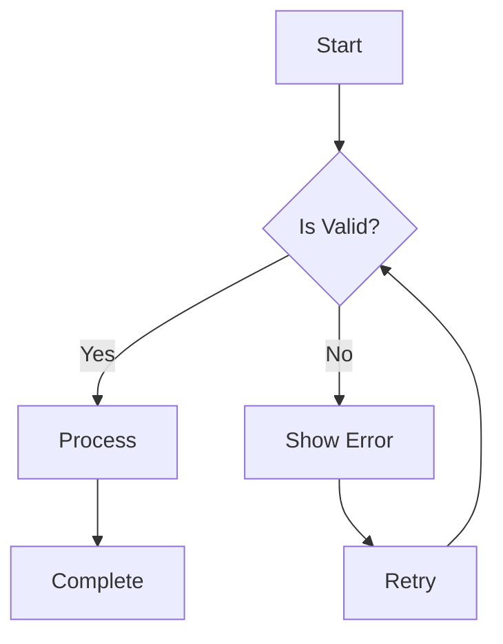

# Documentation Style Guide

## Overview

This style guide ensures consistency, clarity, and professionalism across all Claudia documentation. Following these guidelines helps users find information quickly and understand complex concepts easily.

## Table of Contents

1. [General Principles](#general-principles)
2. [Document Structure](#document-structure)
3. [Writing Style](#writing-style)
4. [Formatting Guidelines](#formatting-guidelines)
5. [Code Examples](#code-examples)
6. [Visual Elements](#visual-elements)
7. [Accessibility](#accessibility)
8. [Version Control](#version-control)
9. [Templates](#templates)
10. [Review Process](#review-process)

## General Principles

### Core Values

1. **Clarity**: Write for understanding, not to impress
2. **Consistency**: Use the same terms and patterns throughout
3. **Completeness**: Include all necessary information
4. **Conciseness**: Be thorough but avoid redundancy
5. **Accessibility**: Write for all skill levels

### Target Audience

Consider three primary audiences:
- **Beginners**: New to Claudia or development
- **Intermediate Users**: Familiar with basics, need specific information
- **Advanced Users**: Experts seeking reference material

## Document Structure

### Standard Layout

Every document should follow this structure:

```markdown
# Document Title

## Overview
Brief description of what this document covers and why it's important.

## Table of Contents
- [Section 1](#section-1)
- [Section 2](#section-2)
- [Section 3](#section-3)

## Prerequisites (if applicable)
What users need to know or have installed before proceeding.

## Main Content
Organized in logical sections with clear headings.

## Examples
Practical, working examples that users can try.

## Troubleshooting (if applicable)
Common issues and their solutions.

## Related Resources
Links to related documentation and external resources.

## Conclusion
Summary and next steps.

---
*Last updated: [Date]*
```

### File Naming Conventions

- Use kebab-case: `visual-progress-monitoring-guide.md`
- Be descriptive: `api-authentication-guide.md` not `auth.md`
- Include document type: `installation-guide.md`, `api-reference.md`
- Avoid version numbers in filenames

### Directory Organization

```
doc/
├── guides/           # How-to guides and tutorials
├── technical/        # Technical references and API docs
├── architecture/     # System design and architecture
├── developer/        # Developer-focused documentation
├── integration/      # Integration guides
├── troubleshooting/  # Problem-solving guides
├── reports/          # Analysis and reports
├── maintenance/      # Operations and maintenance
└── standards/        # Guidelines and standards
```

## Writing Style

### Voice and Tone

- **Active Voice**: "Click the button" not "The button should be clicked"
- **Direct**: "You must" not "It is required that you"
- **Friendly but Professional**: Conversational without being casual
- **Inclusive**: Use "you" to address the reader directly

### Language Guidelines

#### Use Simple Language

❌ **Don't**: "Utilize the subsequent methodology to instantiate the component"  
✅ **Do**: "Use the following method to create the component"

#### Be Specific

❌ **Don't**: "There might be some issues sometimes"  
✅ **Do**: "Database connection errors occur when the server is unreachable"

#### Avoid Jargon

❌ **Don't**: "The ORM facilitates CRUD operations on the persistence layer"  
✅ **Do**: "The database library helps you create, read, update, and delete data"

### Grammar and Punctuation

- **Oxford Comma**: Use it consistently ("red, white, and blue")
- **Contractions**: Acceptable in guides ("don't", "won't", "it's")
- **Sentence Length**: Keep under 25 words when possible
- **Paragraphs**: Limit to 3-5 sentences

## Formatting Guidelines

### Headings

Use hierarchical heading structure:

```markdown
# Page Title (H1 - One per document)

## Major Section (H2)

### Subsection (H3)

#### Minor Subsection (H4)

##### Rarely Used (H5)
```

### Lists

**Unordered Lists** for non-sequential items:
- First item
- Second item
- Third item

**Ordered Lists** for sequential steps:
1. First step
2. Second step
3. Third step

**Definition Lists** for terms:
- **Term**: Definition
- **Another Term**: Its definition

### Emphasis

- **Bold** for important terms and UI elements: "Click the **Save** button"
- *Italic* for emphasis and new terms: "This is called *memoization*"
- `Code` for inline code, commands, and filenames: "Run `npm install`"
- ~~Strikethrough~~ sparingly for deprecated information

### Tables

Use tables for structured data:

| Column 1 | Column 2 | Column 3 |
|----------|----------|----------|
| Data 1   | Data 2   | Data 3   |
| Data 4   | Data 5   | Data 6   |

### Alerts and Callouts

Use blockquotes with emoji for different types of information:

> ℹ️ **Note**: Additional information that's helpful but not critical

> ⚠️ **Warning**: Important information that could cause issues if ignored

> 🚨 **Critical**: Information that could cause data loss or security issues

> 💡 **Tip**: Helpful suggestions for better results

> ✅ **Success**: Confirmation of successful completion

## Code Examples

### Code Block Guidelines

Always include:
1. Language identifier for syntax highlighting
2. Descriptive comments
3. Complete, runnable examples
4. Error handling

```javascript
// Good example with all elements
async function fetchUserData(userId) {
  try {
    // Validate input
    if (!userId) {
      throw new Error('User ID is required');
    }

    // Make API call
    const response = await fetch(`/api/users/${userId}`);
    
    // Check response
    if (!response.ok) {
      throw new Error(`HTTP error! status: ${response.status}`);
    }

    // Return parsed data
    return await response.json();
  } catch (error) {
    console.error('Failed to fetch user data:', error);
    throw error;
  }
}
```

### Command Line Examples

Show both command and expected output:

```bash
# Install dependencies
$ npm install @claudia/ui-components

# Expected output:
added 47 packages, and audited 48 packages in 3s
found 0 vulnerabilities
```

### Configuration Examples

Include comments explaining each option:

```yaml
# claudia.config.yml
server:
  port: 3000          # Server port (default: 3000)
  host: localhost     # Server host (default: localhost)
  
database:
  url: mongodb://localhost:27017/claudia  # MongoDB connection string
  poolSize: 10        # Connection pool size
  
cache:
  enabled: true       # Enable Redis caching
  ttl: 3600          # Cache TTL in seconds (1 hour)
```

## Visual Elements

### Diagrams

Use ASCII art for simple diagrams:

```
┌─────────────┐      ┌─────────────┐
│   Client    │─────▶│   Server    │
└─────────────┘      └─────────────┘
       │                    │
       ▼                    ▼
┌─────────────┐      ┌─────────────┐
│   Cache     │      │  Database   │
└─────────────┘      └─────────────┘
```

### Screenshots

Guidelines for screenshots:
- Use PNG format
- Include alt text for accessibility
- Highlight relevant areas with arrows or boxes
- Keep file sizes under 500KB
- Update when UI changes

```markdown

```

### Flow Charts

Use Mermaid for complex diagrams:



## Accessibility

### Guidelines

1. **Alt Text**: Provide descriptive alt text for all images
2. **Link Text**: Use descriptive link text, not "click here"
3. **Headings**: Use proper heading hierarchy
4. **Tables**: Include header rows and scope attributes
5. **Color**: Don't rely solely on color to convey information

### Examples

❌ **Don't**: "Click [here](link) for more information"  
✅ **Do**: "Read the [installation guide](link) for detailed steps"

❌ **Don't**: "The red text indicates errors"  
✅ **Do**: "Error messages appear in red text with an ❌ icon"

## Version Control

### Documentation Versioning

- **Major Versions**: Significant changes to functionality
- **Minor Versions**: New features or substantial updates
- **Patches**: Small corrections and clarifications

### Change Documentation

Include at the bottom of each document:
```markdown
---
*Version: 1.2.0*  
*Last updated: December 10, 2024*  
*[View change history](link-to-changelog)*
```

### Changelog Format

```markdown
## [1.2.0] - 2024-12-10
### Added
- New section on WebSocket integration
- Code examples for error handling

### Changed
- Updated API endpoints to v2
- Improved troubleshooting section

### Fixed
- Corrected typos in configuration examples
- Fixed broken links to external resources
```

## Templates

### Guide Template

```markdown
# [Feature] Guide

## Overview
[Brief description of the feature and its purpose]

## Prerequisites
- [Requirement 1]
- [Requirement 2]

## Getting Started
[Quick start instructions]

## Detailed Instructions

### Step 1: [Action]
[Detailed instructions with code examples]

### Step 2: [Action]
[Detailed instructions with code examples]

## Configuration Options
[Table or list of configuration options]

## Common Use Cases
[Examples of typical usage scenarios]

## Troubleshooting
[Common issues and solutions]

## Best Practices
[Recommendations for optimal usage]

## Related Resources
- [Link to API reference]
- [Link to related guide]

---
*Last updated: [Date]*
```

### API Reference Template

```markdown
# [Service] API Reference

## Overview
[Description of the API and its purpose]

## Authentication
[Authentication requirements and examples]

## Base URL
```
Production: https://api.claudia.dev/v1
Development: http://localhost:3000/api/v1
```

## Endpoints

### [Endpoint Name]

**Method**: `GET|POST|PUT|DELETE`  
**Path**: `/resource/{id}`  
**Description**: [What this endpoint does]

#### Request Parameters

| Parameter | Type | Required | Description |
|-----------|------|----------|-------------|
| id | string | Yes | Resource identifier |

#### Request Body

```json
{
  "field": "value"
}
```

#### Response

```json
{
  "status": "success",
  "data": {}
}
```

#### Error Responses

| Status | Code | Description |
|--------|------|-------------|
| 400 | INVALID_REQUEST | Invalid parameters |
| 404 | NOT_FOUND | Resource not found |

---
*Last updated: [Date]*
```

## Review Process

### Pre-Publication Checklist

- [ ] Spell check completed
- [ ] Grammar check completed
- [ ] Code examples tested
- [ ] Links verified
- [ ] Screenshots current
- [ ] Formatting consistent
- [ ] Technical accuracy verified
- [ ] Accessibility guidelines followed

### Review Stages

1. **Self-Review**: Author reviews against checklist
2. **Technical Review**: Subject matter expert verifies accuracy
3. **Editorial Review**: Documentation team checks style and clarity
4. **User Testing**: Sample users test instructions
5. **Final Approval**: Documentation lead approves publication

### Feedback Integration

- Monitor user feedback channels
- Track documentation-related issues
- Update based on common questions
- Regular quarterly reviews

## Writing Tips

### Do's

✅ **Start with the user's goal**: "To create a new task..."  
✅ **Use examples**: Show, don't just tell  
✅ **Be explicit**: "Click the blue **Submit** button in the top right"  
✅ **Test your instructions**: Follow them yourself  
✅ **Include prerequisites**: What users need before starting  

### Don'ts

❌ **Assume knowledge**: Explain technical terms  
❌ **Use passive voice**: "The file is created" → "Create the file"  
❌ **Be vague**: "It might take a while" → "Processing takes 2-5 minutes"  
❌ **Skip error handling**: Always explain what could go wrong  
❌ **Use outdated information**: Review and update regularly  

## Tools and Resources

### Recommended Tools

- **Markdown Editors**: VS Code, Typora, Mark Text
- **Grammar Checkers**: Grammarly, Hemingway Editor
- **Diagram Tools**: draw.io, Mermaid, PlantUML
- **Screenshot Tools**: Snagit, ShareX, macOS Screenshot
- **Link Checkers**: Broken Link Checker, W3C Link Checker

### Style References

- [Microsoft Writing Style Guide](https://docs.microsoft.com/style-guide)
- [Google Developer Documentation Style Guide](https://developers.google.com/style)
- [Write the Docs Community](https://www.writethedocs.org)

## Conclusion

Consistent, clear documentation is crucial for Claudia's success. By following this style guide, we ensure that all users can effectively understand and use Claudia's features. Remember: good documentation is an investment in our users' success.

For questions about this guide, contact the documentation team or submit an issue in the documentation repository.

---
*Version: 1.0.0*  
*Last updated: December 2024*